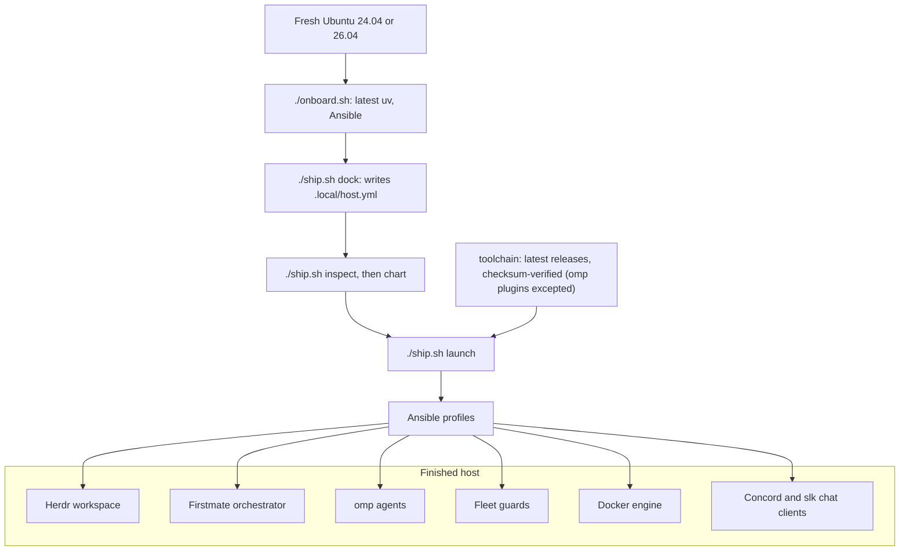

<div align="center">

# 🚢 Crewship

**Turn a fresh Ubuntu machine into a self-hosted AI coding agent fleet.**

[](https://github.com/i098/Crewship/actions/workflows/ci.yml)
[](https://github.com/i098/Crewship/releases/latest)
[](LICENSE)
[](https://github.com/i098/Crewship/stargazers)
[](https://github.com/i098/Crewship/commits/main)
[](https://github.com/sponsors/i098)

[Docs](#docs) · [Install](#quick-start) · [Changelog](CHANGELOG.md) · [Discussions](https://github.com/i098/Crewship/discussions)


*A finished host: Herdr lists the workspaces and agents on the left, and omp agents work side by side.*

</div>

## Why Crewship

- **Self-hosted AI coding agents:** one Ubuntu 24.04 or 26.04 machine runs Herdr, the Firstmate orchestrator, and the omp agent fleet. No cloud dependencies.
- **Reproducible with Ansible:** profiles in one host file, a check-mode preview with `./ship.sh chart`, and one `./ship.sh launch` that changes the host. No Nix, no chezmoi.
- **Checksum-verified toolchain:** every apply installs the latest releases and verifies their checksums. The three omp marketplace plugins are the one exception.
- **Built for an agent fleet:** fleet guards, auto pruners, a self-hosted CI pool, and the Concord (Discord) and slk (Slack) terminal chat clients.

<details>
<summary><b>Features</b></summary>

- [Herdr workspace](docs/herdr.md): a sidebar of spaces and agents, with live status for each lane
- [omp agents](docs/omp.md): sign-in, model roles, fallbacks, and the advisor
- [Fleet guards](docs/fleet-guards.md): shared Supabase, Docker guard, dev-server reaper, storage guard, browser ladder
- [Capacity and auto pruners](docs/capacity.md): host sizing per lane count, and cleanup timers
- [Self-hosted CI pool](docs/ci-pool.md): GitHub Actions runners, one job per fresh container
- [Chat clients](docs/chat.md): Concord (Discord) and slk (Slack) in the terminal
- [iMessage bridge](docs/imessage.md): text Firstmate from your phone
- [Shared credentials](docs/secrets.md): `super.env` in Cloudflare Secrets Store
- [Google Workspace CLI](docs/google-workspace.md): `gws` with several Google accounts on a headless host
- [herdr-patch](herdr-patch/README.md): Herdr over mosh with real images
- [Checksum-verified toolchain](docs/dependencies.md): every tool, package, and image the recipe installs
- [Migration and recovery](docs/recovery.md): new-device sequence, desktop access, upgrades
- [Agent host move](docs/agent-host-move.md): move the agents to a new host with parity checks
- [Security](docs/security.md): credential handling and remote access

</details>

## How it works



## Quick start

### Get a machine

Rent an Ubuntu 24.04 or 26.04 server from any VPS or cloud provider, for example [Hetzner Cloud](https://www.hetzner.com/cloud/), [OVHcloud VPS](https://www.ovhcloud.com/en/vps/), or [DigitalOcean Droplets](https://www.digitalocean.com/products/droplets). A spare machine at home works too.

| Size | vCPU | RAM | Disk | Runs in parallel | Source |
| --- | --- | --- | --- | --- | --- |
| Small | 4 | 16 GB | 100 GB | 2 light lanes | estimated |
| Medium | 16 | 64 GB | 300 GB | 4 UI lanes + 8 light lanes, or 16 light lanes | estimated |
| Large (a real host) | 96, x86_64 | 247 GB | 235 GB system disk, two ~2 TB data disks | 37 agent processes used about 67 GB RAM (about 0.35 GB each) at a load average of 30-35 | measured |

Builds, tests, and browsers set the limit, not the agents; each CI job is capped at 4 CPUs and 8 GB. See [Capacity and pruners](docs/capacity.md) for the formula.

### Install

You need Ubuntu 24.04 or 26.04 on x86_64 or aarch64 with systemd, a non-root account with sudo, Python 3.12+, `git`, and `gh`. [`cloud-init/user-data.yaml`](cloud-init/user-data.yaml) can preinstall the OS packages on first boot.

1. Authenticate GitHub (for private repositories and gh-axi):

   ```bash
   gh auth login
   ```

2. Clone the repository:

   ```bash
   git clone https://github.com/i098/Crewship.git
   cd Crewship
   ```

3. Install the repository tooling (the latest uv, then the locked Python environment with Ansible):

   ```bash
   ./onboard.sh
   ```

4. Create your host config, then review its profiles, user, and paths:

   ```bash
   ./ship.sh dock
   ${EDITOR:-nano} .local/host.yml
   ```

5. Validate the config and preview the changes. `chart` is Ansible check mode and changes nothing:

   ```bash
   ./ship.sh inspect
   ./ship.sh chart
   ```

6. Launch. This is the only step that changes the host, and it may ask for your sudo password. With the `firstmate` profile on, the first successful interactive apply after you sign in to omp opens the [new-host questions](docs/configuration.md#new-host-questions); a fresh host's first apply installs omp, so sign in to omp after it and rerun apply:

   ```bash
   ./ship.sh launch
   ```

7. Check the result:

   ```bash
   ./ship.sh survey
   ```

Then authenticate the agent CLIs on this account; for omp, follow [Sign in](docs/omp.md#sign-in). Credentials are never copied from another host; see [Migration and recovery](docs/recovery.md).

## Docs

| Doc | What it covers |
| --- | --- |
| [Configuration](docs/configuration.md) | `.local/host.yml`, the `./ship.sh` commands, and what each profile installs |
| [Dependencies](docs/dependencies.md) | Every tool, package, and image the recipe installs, and what the host must already have |
| [Fleet guards](docs/fleet-guards.md) | Shared Supabase, Docker guard, dev-server reaper, storage guard, spawn memory floor, browser ladder |
| [Herdr sidebar](docs/herdr.md) | The Spaces and Agents sidebar layouts, what each line and token shows, the reporter timer and omp extension that feed them, and how to override them or turn parts off |
| [herdr-patch](herdr-patch/README.md) | Herdr over mosh: no opaque background fill, and real images with `herdr-patch <user>@<host>` |
| [omp configuration](docs/omp.md) | Signing in, model roles, fallbacks, the advisor, and updating an existing host |
| [Chat clients](docs/chat.md) | The Concord (Discord) and slk (Slack) terminal clients: install, config, and sign-in |
| [iMessage bridge](docs/imessage.md) | Optional: text Firstmate over a Photon Spectrum iMessage line, with a front desk that steps in when Firstmate stays quiet, and send, reply, typing, tapback, and location commands |
| [Capacity and pruners](docs/capacity.md) | Host sizing per lane count and every auto pruner |
| [CI pool](docs/ci-pool.md) | Self-hosted GitHub Actions slots: one job per fresh container, sized from half of the host's CPU and memory |
| [Architecture](docs/architecture.md) | Why Ansible, host and container boundary, Docker worker, CI |
| [Migration and recovery](docs/recovery.md) | New-device sequence, desktop access, troubleshooting, upgrades |
| [Security](docs/security.md) | What is never exported, how to handle credentials, and remote access, including SSH between the host and a Mac and prompt-free Dia remote debugging on the Mac |
| [Shared credentials](docs/secrets.md) | `super.env` in Cloudflare Secrets Store: push, fetch on a new host, revoke |
| [Google Workspace CLI](docs/google-workspace.md) | `gws`: one OAuth client in testing mode, sign-in for several Google accounts, and carrying each login to a headless host |
| [Agent host move](docs/agent-host-move.md) | Moving the agents to a new host: what to copy by hand, parity checks, cutover |

Contributing: [CONTRIBUTING.md](CONTRIBUTING.md). Security: [SECURITY.md](SECURITY.md). Code of conduct: [CODE_OF_CONDUCT.md](CODE_OF_CONDUCT.md). License: [FSL-1.1-Apache-2.0](LICENSE).

## Sponsors

If Crewship saves you time, sponsor its development on GitHub.

<a href="https://github.com/sponsors/i098"></a>

No sponsors yet. Be the first, and your name goes here.

## Star history

<a href="https://star-history.com/#i098/Crewship&Date">
  <picture>
    <source media="(prefers-color-scheme: dark)" srcset="https://api.star-history.com/svg?repos=i098/Crewship&type=Date&theme=dark">
    <source media="(prefers-color-scheme: light)" srcset="https://api.star-history.com/svg?repos=i098/Crewship&type=Date">
    
  </picture>
</a>
