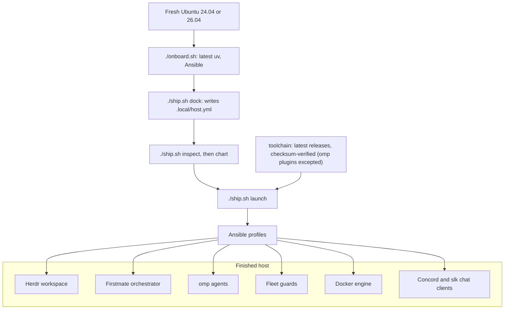

# 🚢 Crewship

Turn a fresh Ubuntu machine into a reproducible AI-agent coding host: Herdr, Firstmate, the omp agent fleet, and the Concord (Discord) and slk (Slack) terminal chat clients, provisioned by Ansible from a checksum-verified toolchain (the three omp marketplace plugins are the one exception). No Nix, no chezmoi, no cloud dependencies. Each apply installs the latest Concord and slk release and verifies its checksum; see [docs/chat.md](docs/chat.md).


*A finished host: Herdr lists the workspaces and agents on the left, and omp agents work side by side.*



## Quick start

You need Ubuntu 24.04 or 26.04 on x86_64 or aarch64 with systemd, a non-root account with sudo, Python 3.12+, `git`, and `gh`. [`cloud-init/user-data.yaml`](cloud-init/user-data.yaml) can preinstall the OS packages on first boot.

1. Authenticate GitHub (for private repositories and gh-axi):

   ```bash
   gh auth login
   ```

2. Clone the repository:

   ```bash
   git clone https://github.com/i098/Crewship.git
   cd Crewship
   ```

3. Install the repository tooling (the latest uv, then the locked Python environment with Ansible):

   ```bash
   ./onboard.sh
   ```

4. Create your host config, then review its profiles, user, and paths:

   ```bash
   ./ship.sh dock
   ${EDITOR:-nano} .local/host.yml
   ```

5. Validate the config and preview the changes. `chart` is Ansible check mode and changes nothing:

   ```bash
   ./ship.sh inspect
   ./ship.sh chart
   ```

6. Launch. This is the only step that changes the host, and it may ask for your sudo password. With the `firstmate` profile on, the first successful interactive apply after you sign in to omp opens the [new-host questions](docs/configuration.md#new-host-questions); a fresh host's first apply installs omp, so sign in to omp after it and rerun apply:

   ```bash
   ./ship.sh launch
   ```

7. Check the result:

   ```bash
   ./ship.sh survey
   ```

Then authenticate the agent CLIs on this account; for omp, follow [Sign in](docs/omp.md#sign-in). Credentials are never copied from another host; see [Migration and recovery](docs/recovery.md).

## Docs

| Doc | What it covers |
| --- | --- |
| [Configuration](docs/configuration.md) | `.local/host.yml`, the `./ship.sh` commands, and what each profile installs |
| [Dependencies](docs/dependencies.md) | Every tool, package, and image the recipe installs, and what the host must already have |
| [Fleet guards](docs/fleet-guards.md) | Shared Supabase, Docker guard, dev-server reaper, storage guard, spawn memory floor, browser ladder |
| [Herdr sidebar](docs/herdr.md) | The Spaces and Agents sidebar layouts, what each line and token shows, the reporter timer and omp extension that feed them, and how to override them or turn parts off |
| [herdr-patch](herdr-patch/README.md) | Herdr over mosh: no opaque background fill, and real images with `herdr-patch <user>@<host>` |
| [omp configuration](docs/omp.md) | Signing in, model roles, fallbacks, the advisor, and updating an existing host |
| [Chat clients](docs/chat.md) | The Concord (Discord) and slk (Slack) terminal clients: install, config, and sign-in |
| [iMessage bridge](docs/imessage.md) | Optional: text Firstmate over a Photon Spectrum iMessage line, with a front desk that steps in when Firstmate stays quiet, and send, reply, typing, tapback, and location commands |
| [Capacity and pruners](docs/capacity.md) | Host sizing per lane count and every auto pruner |
| [CI pool](docs/ci-pool.md) | Self-hosted GitHub Actions slots: one job per fresh container, sized from half of the host's CPU and memory |
| [Architecture](docs/architecture.md) | Why Ansible, host and container boundary, Docker worker, CI |
| [Migration and recovery](docs/recovery.md) | New-device sequence, desktop access, troubleshooting, upgrades |
| [Security](docs/security.md) | What is never exported, how to handle credentials, and remote access, including SSH between the host and a Mac and prompt-free Dia remote debugging on the Mac |
| [Shared credentials](docs/secrets.md) | `super.env` in Cloudflare Secrets Store: push, fetch on a new host, revoke |
| [Google Workspace CLI](docs/google-workspace.md) | `gws`: one OAuth client in testing mode, sign-in for several Google accounts, and carrying each login to a headless host |
| [Agent host move](docs/agent-host-move.md) | Moving the agents to a new host: what to copy by hand, parity checks, cutover |

Contributing: [CONTRIBUTING.md](CONTRIBUTING.md). License: [MIT](LICENSE).
