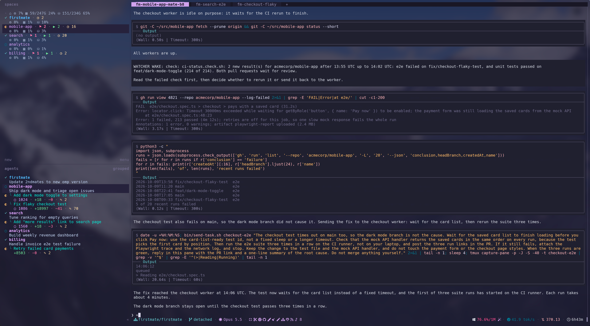
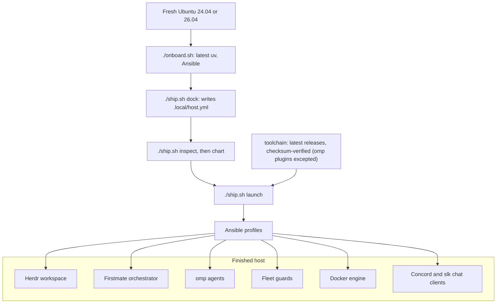

<div align="center">

# 🚢 Crewship

**Turn a fresh Ubuntu machine into a self-hosted AI coding agent fleet.**

[](https://github.com/i098/Crewship/actions/workflows/ci.yml)
[](https://github.com/i098/Crewship/releases/latest)
[](LICENSE)
[](https://github.com/i098/Crewship/stargazers)
[](https://github.com/i098/Crewship/commits/main)
[](https://github.com/sponsors/i098)

[Docs](#docs) · [Install](#quick-start) · [Changelog](CHANGELOG.md) · [Discussions](https://github.com/i098/Crewship/discussions)



*A finished host: Herdr lists the workspaces and agents on the left, and omp agents work side by side.*

</div>

## Why Crewship

- **Self-hosted AI coding agents:** one Ubuntu 24.04 or 26.04 machine runs Herdr, the Firstmate orchestrator, and the omp agent fleet. No cloud dependencies.
- **Reproducible with Ansible:** profiles in one host file, a check-mode preview with `./ship.sh chart`, and one `./ship.sh launch` that changes the host. No Nix, no chezmoi.
- **Checksum-verified toolchain:** every apply installs the latest releases and verifies their checksums. The three omp marketplace plugins are the one exception.
- **Built for an agent fleet:** fleet guards, auto pruners, a self-hosted CI pool, and the Concord (Discord) and slk (Slack) terminal chat clients.

<details>
<summary><b>Features</b></summary>

- [Herdr workspace](docs/herdr.md): a sidebar of spaces and agents, with live status for each lane
- [omp agents](docs/omp.md): sign-in, model roles, fallbacks, and the advisor
- [Fleet guards](docs/fleet-guards.md): shared Supabase, Docker guard, dev-server reaper, storage guard, browser ladder
- [Capacity and auto pruners](docs/capacity.md): host sizing per lane count, and cleanup timers
- [Self-hosted CI pool](docs/ci-pool.md): GitHub Actions runners, one job per fresh container
- [Chat clients](docs/chat.md): Concord (Discord) and slk (Slack) in the terminal
- [GitHub board](docs/github-board.md): agent work as issues on a Project board, and a shared message board
- [iMessage bridge](docs/imessage.md): text Firstmate from your phone
- [Shared credentials](docs/secrets.md): `super.env` in Cloudflare Secrets Store
- [Google Workspace CLI](docs/google-workspace.md): `gws` with several Google accounts on a headless host
- [herdr-patch](herdr-patch/README.md): Herdr over mosh with real images
- [Checksum-verified toolchain](docs/dependencies.md): every tool, package, and image the recipe installs
- [Migration and recovery](docs/recovery.md): new-device sequence, desktop access, upgrades
- [Agent host move](docs/agent-host-move.md): move the agents to a new host with parity checks
- [Security](docs/security.md): credential handling and remote access

</details>

## How it works



## Quick start

### Get a machine

Rent an Ubuntu 24.04 or 26.04 server from any VPS or cloud provider, for example [Hetzner Cloud](https://www.hetzner.com/cloud/), [OVHcloud VPS](https://www.ovhcloud.com/en/vps/), or [DigitalOcean Droplets](https://www.digitalocean.com/products/droplets). A spare machine at home works too.

Runs on 4 vCPU / 16 GB and up; a 96 vCPU / 247 GB host ran 37 agents in about 67 GB RAM ([Capacity](docs/capacity.md)).

### Install

With curl:

```bash
curl -fsSL https://raw.githubusercontent.com/i098/Crewship/main/install.sh | bash
```

With npx:

```bash
npx crewship
```

With bunx:

```bash
bunx crewship
```

With pnpm:

```bash
pnpm dlx crewship
```

Sign in to GitHub:

```bash
gh auth login
```

[Sign in to omp](docs/omp.md#sign-in):

```bash
omp
```

<details>
<summary>Manual Quick Start</summary>

You need Ubuntu 24.04 or 26.04 on x86_64 or aarch64 with systemd, a non-root account with sudo, Python 3.12+, `git`, and `gh`. [`cloud-init/user-data.yaml`](cloud-init/user-data.yaml) can preinstall the OS packages on first boot.

1. Authenticate GitHub (for private repositories and gh-axi):

   ```bash
   gh auth login
   ```

2. Clone the repository:

   ```bash
   git clone https://github.com/i098/Crewship.git
   cd Crewship
   ```

3. Install the repository tooling (the latest uv, then the locked Python environment with Ansible):

   ```bash
   ./onboard.sh
   ```

4. Create your host config, then review its profiles, user, and paths:

   ```bash
   ./ship.sh dock
   ${EDITOR:-nano} .local/host.yml
   ```

5. Validate the config and preview the changes. `chart` is Ansible check mode and changes nothing:

   ```bash
   ./ship.sh inspect
   ./ship.sh chart
   ```

6. Launch. This is the only step that changes the host, and it may ask for your sudo password. With the `firstmate` profile on, the first successful interactive apply after you sign in to omp opens the [new-host questions](docs/configuration.md#new-host-questions); a fresh host's first apply installs omp, so sign in to omp after it and rerun apply:

   ```bash
   ./ship.sh launch
   ```

7. Check the result:

   ```bash
   ./ship.sh survey
   ```

Then authenticate the agent CLIs on this account; for omp, follow [Sign in](docs/omp.md#sign-in). Credentials are never copied from another host; see [Migration and recovery](docs/recovery.md).

</details>

## Docs

| Doc | What it covers |
| --- | --- |
| [Configuration](docs/configuration.md) | `.local/host.yml`, the `./ship.sh` commands, and what each profile installs |
| [Dependencies](docs/dependencies.md) | Every tool, package, and image the recipe installs, and what the host must already have |
| [Fleet guards](docs/fleet-guards.md) | Shared Supabase, Docker guard, dev-server reaper, storage guard, spawn memory floor, browser ladder |
| [Herdr sidebar](docs/herdr.md) | The Spaces and Agents sidebar layouts, what each line and token shows, the reporter timer and omp extension that feed them, and how to override them or turn parts off |
| [herdr-patch](herdr-patch/README.md) | Herdr over mosh: no opaque background fill, and real images with `herdr-patch <user>@<host>` |
| [omp configuration](docs/omp.md) | Signing in, model roles, fallbacks, the advisor, and updating an existing host |
| [Chat clients](docs/chat.md) | The Concord (Discord) and slk (Slack) terminal clients: install, config, and sign-in |
| [GitHub board](docs/github-board.md) | Optional: one issue per Firstmate work item, a Project board with its status, progress notes as issue comments, and a shared message board for agents |
| [Crew board](docs/board.md) | Optional: a host-local, in-memory message board that agents use to send messages to each other, run as a user service |
| [iMessage bridge](docs/imessage.md) | Optional: text Firstmate over a Photon Spectrum iMessage line, with a front desk that steps in when Firstmate stays quiet, and send, reply, typing, tapback, and location commands |
| [Capacity and pruners](docs/capacity.md) | Host sizing per lane count and every auto pruner |
| [CI pool](docs/ci-pool.md) | Self-hosted GitHub Actions slots: one job per fresh container, sized from half of the host's CPU and memory |
| [Architecture](docs/architecture.md) | Why Ansible, host and container boundary, Docker worker, CI |
| [Migration and recovery](docs/recovery.md) | New-device sequence, desktop access, troubleshooting, upgrades |
| [Security](docs/security.md) | What is never exported, how to handle credentials, and remote access, including SSH between the host and a Mac and prompt-free Dia remote debugging on the Mac |
| [Shared credentials](docs/secrets.md) | `super.env` in Cloudflare Secrets Store: push, fetch on a new host, revoke |
| [Google Workspace CLI](docs/google-workspace.md) | `gws`: one OAuth client in testing mode, sign-in for several Google accounts, and carrying each login to a headless host |
| [Agent host move](docs/agent-host-move.md) | Moving the agents to a new host: what to copy by hand, parity checks, cutover |

Contributing: [CONTRIBUTING.md](CONTRIBUTING.md). Support: [SUPPORT.md](SUPPORT.md). Security: [SECURITY.md](SECURITY.md). Code of conduct: [CODE_OF_CONDUCT.md](CODE_OF_CONDUCT.md). License: [FSL-1.1-Apache-2.0](LICENSE).

## Built with

Crewship installs or builds on these third-party projects. Each license comes from the project's own repository or package metadata. The full install list is in [Dependencies](docs/dependencies.md).

- [Herdr](https://github.com/herdrdev/herdr) (`herdr`): the terminal workspace that holds the agent panes. License: Apache-2.0.
- [Firstmate](https://github.com/kunchenguid/firstmate): the orchestrator of the agent fleet, patched by Crewship. Watch: [how Firstmate's author uses it](https://www.youtube.com/watch?v=MSbacZ99E14). License: MIT.
- [omp](https://github.com/can1357/oh-my-pi) (`omp`): the coding agent. License: MIT.
- [ponytail](https://github.com/DietrichGebert/ponytail) (`ponytail`): omp marketplace plugin, least-code rules for agents. License: MIT.
- [i-have-adhd](https://github.com/ayghri/i-have-adhd) (`i-have-adhd`): omp marketplace plugin, short answer-first output. License: MIT.
- [caveman](https://github.com/JuliusBrussee/caveman) (`caveman`): omp marketplace plugin, compressed agent output. License: Apache-2.0.
- [no-mistakes](https://github.com/kunchenguid/no-mistakes) (`no-mistakes`): the review, test, and CI pipeline for agent pull requests. License: MIT.
- [treehouse](https://github.com/kunchenguid/treehouse) (`treehouse`): the pool of git worktrees for agent lanes. License: MIT.
- [acpx](https://github.com/openclaw/acpx) (`acpx`): the Agent Client Protocol client that runs the fallback gate agent. License: MIT.
- [gh-axi](https://github.com/kunchenguid/gh-axi) (`gh-axi`): GitHub access for agents. License: MIT.
- [chrome-devtools-axi](https://github.com/kunchenguid/chrome-devtools-axi) (`chrome-devtools-axi`): browser control for agents. License: MIT.
- [chrome-devtools-mcp](https://github.com/ChromeDevTools/chrome-devtools-mcp) (`chrome-devtools-mcp`): the DevTools server behind chrome-devtools-axi. License: Apache-2.0.
- [lavish-axi](https://github.com/kunchenguid/lavish-axi) (`lavish-axi`): HTML plans, tables, and diagrams from agents. License: MIT.
- [quota-axi](https://github.com/kunchenguid/quota-axi) (`quota-axi`): agent provider quota windows. License: MIT.
- [tasks-axi](https://github.com/kunchenguid/tasks-axi) (`tasks-axi`): the task backlog of Firstmate. License: MIT.
- [GitHub CLI](https://github.com/cli/cli) (`gh`): GitHub access. License: MIT.
- [Google Workspace CLI](https://github.com/googleworkspace/cli) (`gws`): Google Workspace access for agents. License: Apache-2.0.
- [Sentrux](https://github.com/sentrux/sentrux) (`sentrux`, `sentrux-grammars`): the structural quality gate. License: MIT.
- [Fallow](https://github.com/fallow-rs/fallow) (`fallow`): JavaScript and TypeScript changed-code checks. License: MIT.
- [Concord](https://github.com/chojs23/concord) (`concord`): the Discord terminal client. License: GPL-3.0-only.
- [slk](https://github.com/gammons/slk) (`slk`): the Slack terminal client. License: MIT.
- [Obscura](https://github.com/h4ckf0r0day/obscura) (`obscura`): the headless browser of the fleet browser ladder. License: Apache-2.0.
- [Koncreet](https://github.com/jimididit/koncreet) (`koncreet`): host hardening, patched by Crewship. License: MIT.
- [Bun](https://github.com/oven-sh/bun) (`bun`): the JavaScript runtime and package manager. License: MIT.
- [Node.js](https://github.com/nodejs/node) (`node`): the runtime of the npm tools. License: MIT.
- [uv](https://github.com/astral-sh/uv) (`uv`): the Python bootstrap and environments. License: MIT OR Apache-2.0.
- [btop](https://github.com/aristocratos/btop) (`btop`): the resource monitor pane. License: Apache-2.0.
- [rustup](https://github.com/rust-lang/rustup) (`rustup-init`): the Rust toolchain of the `development` profile. License: MIT OR Apache-2.0.
- [Ansible](https://github.com/ansible/ansible): runs the recipe. License: GPL-3.0-or-later.
- [jsonschema](https://github.com/python-jsonschema/jsonschema): validates the host config. License: MIT.
- [PyYAML](https://github.com/yaml/pyyaml): reads the host config. License: MIT.
- [pytest](https://github.com/pytest-dev/pytest): the test suite. License: MIT.
- [Ruff](https://github.com/astral-sh/ruff): lint and format. License: MIT.
- [psutil](https://github.com/giampaolo/psutil) (`psutil`): process data for the Chrome autopruner. License: BSD-3-Clause.
- [Supabase CLI](https://github.com/supabase/cli) (`supabase`): the shared Supabase stack of the fleet guards. License: MIT.
- [spectrum-ts](https://github.com/photon-hq/spectrum-ts) (`spectrum-ts`): the iMessage bridge SDK. License: MIT.
- [Docker Engine](https://github.com/moby/moby): containers for the worker, the CI pool, and Supabase. License: Apache-2.0.
- [Docker Compose](https://github.com/docker/compose): the worker and backing services. License: Apache-2.0.
- [GitHub Actions Runner](https://github.com/actions/runner): the image of the self-hosted CI pool. License: MIT.
- [Tailscale](https://github.com/tailscale/tailscale): the private network to the host. License: BSD-3-Clause.
- [Google Chrome](https://www.google.com/chrome/): the headed browser of the desktop and the browser ladder. License: proprietary.
- [mosh](https://github.com/mobile-shell/mosh): the roaming shell for Herdr. License: GPL-3.0-or-later.
- [Xfce](https://www.xfce.org/): the remote desktop. License: GPL-2.0-or-later.
- [TigerVNC](https://github.com/TigerVNC/tigervnc): the VNC server of the desktop. License: GPL-2.0-or-later.
- [noVNC](https://github.com/novnc/noVNC): the VNC client in the browser. License: MPL-2.0.
- [websockify](https://github.com/novnc/websockify): the WebSocket bridge for noVNC. License: LGPL-3.0-only.
- [ripgrep](https://github.com/BurntSushi/ripgrep): code search in the `development` profile. License: Unlicense OR MIT.
- [PostgreSQL](https://www.postgresql.org/): an optional compose backing service. License: PostgreSQL.
- [Redis](https://github.com/redis/redis): an optional compose backing service. License: RSALv2 OR SSPLv1 OR AGPLv3.
- [Headroom](https://github.com/headroomlabs-ai/headroom): an optional model proxy, patched by Crewship. License: Apache-2.0.
- [pxpipe](https://github.com/teamchong/pxpipe): an optional model proxy, patched by Crewship. License: MIT.
- [Ubuntu](https://ubuntu.com/): the host OS, the worker image base, and the other packages in [Dependencies](docs/dependencies.md). License: per package.
- [cloud-init](https://github.com/canonical/cloud-init): first-boot package setup. License: GPL-3.0-only OR Apache-2.0.
- [Python](https://github.com/python/cpython): runs the recipe scripts. License: PSF-2.0.
- [Git](https://github.com/git/git): version control for every lane. License: GPL-2.0-only.

## Sponsors

If Crewship saves you time, sponsor its development on GitHub.

<a href="https://github.com/sponsors/i098"></a>

<!-- The sponsors workflow writes the sponsor list between these markers; the line below is FALLBACK in scripts/sponsors.py. -->
<!-- sponsors -->
No sponsors yet. Be the first, and your name goes here.
<!-- /sponsors -->

## Star history

<a href="https://star-history.com/#i098/Crewship&Date">
  <picture>
    <source media="(prefers-color-scheme: dark)" srcset="https://api.star-history.com/svg?repos=i098/Crewship&type=Date&theme=dark">
    <source media="(prefers-color-scheme: light)" srcset="https://api.star-history.com/svg?repos=i098/Crewship&type=Date">
    
  </picture>
</a>
