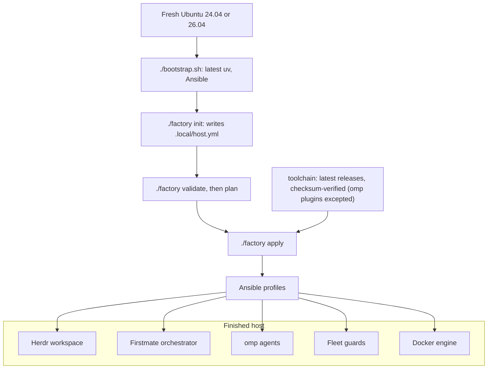

# ⚡ Code Factory

Turn a fresh Ubuntu machine into a reproducible AI-agent coding host: Herdr, Firstmate, and the omp agent fleet, provisioned by Ansible from a checksum-verified toolchain (the three omp marketplace plugins are the one exception). No Nix, no chezmoi, no cloud dependencies.



## Quick start

You need Ubuntu 24.04 or 26.04 on x86_64 or aarch64 with systemd, a non-root account with sudo, Python 3.12+, `git`, and `gh`. [`cloud-init/user-data.yaml`](cloud-init/user-data.yaml) can preinstall the OS packages on first boot.

1. Authenticate GitHub (for private repositories and gh-axi):

   ```bash
   gh auth login
   ```

2. Clone the repository:

   ```bash
   git clone https://github.com/undeemed/Code-Factory.git
   cd Code-Factory
   ```

3. Install the repository tooling (the latest uv, then the locked Python environment with Ansible):

   ```bash
   ./bootstrap.sh
   ```

4. Create your host config, then review its profiles, user, and paths:

   ```bash
   ./factory init
   ${EDITOR:-nano} .local/host.yml
   ```

5. Validate the config and preview the changes. `plan` is Ansible check mode and changes nothing:

   ```bash
   ./factory validate
   ./factory plan
   ```

6. Apply. This is the only step that changes the host, and it may ask for your sudo password. With the `firstmate` profile on, the first successful interactive apply after you sign in to omp opens the [new-host questions](docs/configuration.md#new-host-questions); a fresh host's first apply installs omp, so sign in to omp after it and rerun apply:

   ```bash
   ./factory apply
   ```

7. Check the result:

   ```bash
   ./factory doctor
   ```

Then authenticate the agent CLIs on this account; for omp, follow [Sign in](docs/omp.md#sign-in). Credentials are never copied from another host; see [Migration and recovery](docs/recovery.md).

## Docs

| Doc | What it covers |
| --- | --- |
| [Configuration](docs/configuration.md) | `.local/host.yml`, the `./factory` commands, and what each profile installs |
| [Dependencies](docs/dependencies.md) | Every tool, package, and image the recipe installs, and what the host must already have |
| [Fleet guards](docs/fleet-guards.md) | Shared Supabase, Docker guard, dev-server reaper, storage guard, spawn memory floor, browser ladder |
| [Herdr sidebar](docs/herdr.md) | The Spaces and Agents sidebar layouts, what each line and token shows, the reporter timer and omp extension that feed them, and how to override them or turn parts off |
| [omp configuration](docs/omp.md) | Signing in, model roles, fallbacks, the advisor, and updating an existing host |
| [Capacity and pruners](docs/capacity.md) | Host sizing per lane count and every auto pruner |
| [Architecture](docs/architecture.md) | Why Ansible, host and container boundary, Docker worker, CI |
| [Migration and recovery](docs/recovery.md) | New-device sequence, desktop access, troubleshooting, upgrades |
| [Security](docs/security.md) | What is never exported and how to handle credentials and remote access |
| [Shared credentials](docs/secrets.md) | `super.env` in Cloudflare Secrets Store: push, fetch on a new host, revoke |
| [Agent host move](docs/agent-host-move.md) | Moving the agents to a new host: what to copy by hand, parity checks, cutover |

Contributing: [CONTRIBUTING.md](CONTRIBUTING.md). License: [MIT](LICENSE).
