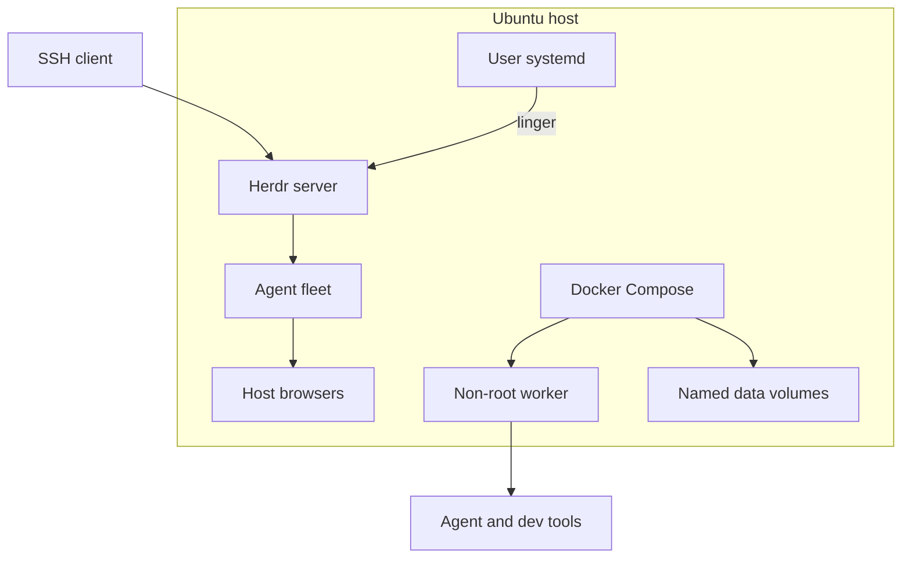
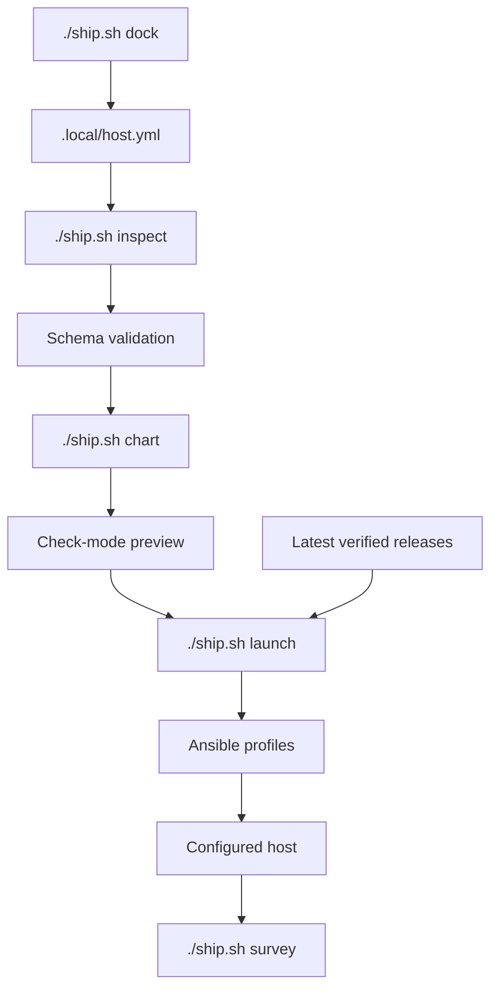
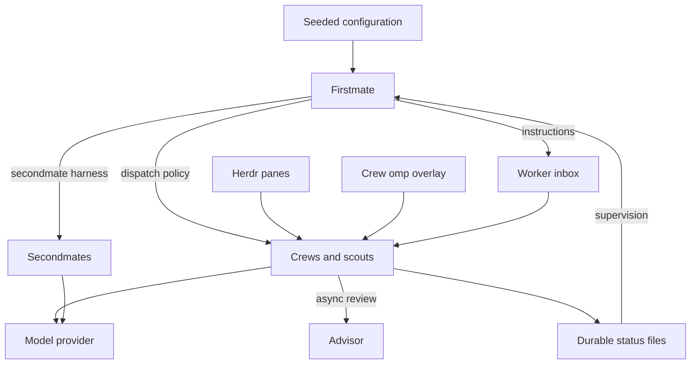
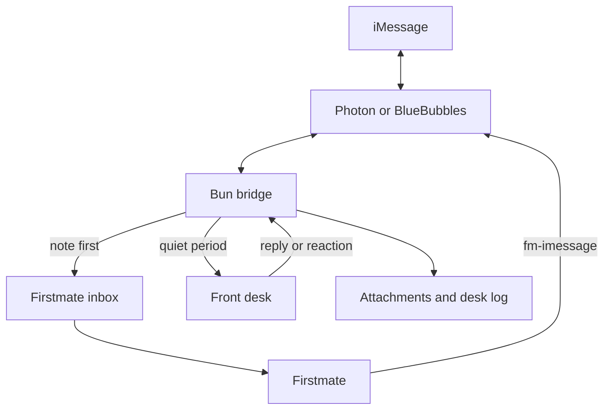
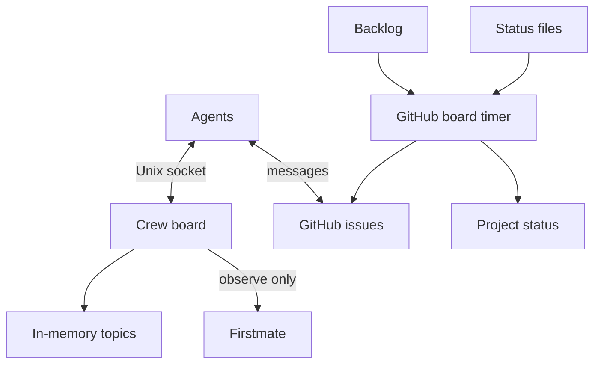
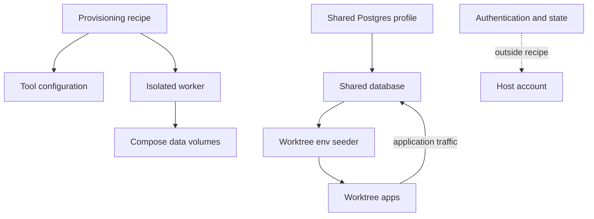

# Crewship architecture

## Host layout

Ansible manages the host; optional containers keep separate process and filesystem lifecycles.

## Provisioning

Validate the host file, preview the changes, then apply selected profiles; omp plugins have no publisher checksums.

## Agent fleet and supervision

Firstmate supervises work through inboxes and status files; crews use the dispatch policy and call model providers directly.

## iMessage

The optional bridge files each message before the front desk runs; Firstmate sends the full answer.

## Boards

The optional crew board keeps temporary host-local messages; the GitHub board reads backlog and status without changing supervision.

## Data boundaries

Authentication and mutable state stay outside the recipe.
See [Shared Postgres](shared-postgres.md) for the optional worktree database.

[Agent architecture reference](agents/architecture.md)
