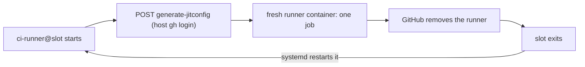

# CI pool

The CI pool runs GitHub Actions jobs on this host with no runner to register or remove by hand. One list in `.local/host.yml` names each repository and its number of slots. Each slot is a systemd user unit that asks GitHub for a just-in-time (JIT) runner, runs one job in a fresh container, and exits. GitHub removes a JIT runner after its one job, and systemd starts the slot again for the next job.



## Opt a repository in

1. Add the repository to `factory.ci_pool.repos` in `.local/host.yml`:

   ```yaml
   factory:
     ci_pool:
       data_dir: /mnt/data/ci     # on a data disk, not the system disk
       # total_slots: auto        # or a number; see "Pool size"
       # job_cpus: 4              # CPU cap of each job container
       # job_memory_gb: 8         # memory cap of each job container
       repos:
         - repo: owner/name
           slots: 2
           labels: [my-label]
   ```

2. Run `./factory apply`. To change only the pool, without a full apply, use [Apply without the playbook](#apply-without-the-playbook).
3. In the repository's workflow, run the job on the pool:

   ```yaml
   runs-on: [self-hosted, my-label]
   ```

Every slot carries the `self-hosted` label and the labels of its repository entry. The account that runs the pool must have a `gh` login that can administer the repository's runners (the `repo` scope).

To remove a repository, delete its entry and apply again. Its units stop and are disabled, and its work and cache directories are deleted. To stop the whole pool, set `repos: []` and apply. Removing the whole `ci_pool` section does not stop running slots, because apply then skips the pool.

## Configuration

| Key | Default | Meaning |
| --- | --- | --- |
| `data_dir` | required | Root of every work directory and cache. Apply creates it, owned by `factory.user`. Put it on a data disk. |
| `total_slots` | `auto` | Most slots the pool runs. `auto` computes it at apply (see below). A number fixes it. |
| `job_cpus` | `4` | `docker --cpus` of each job container. |
| `job_memory_gb` | `8` | `docker --memory` and `--memory-swap` of each job container, in GiB. |
| `repos[].repo` | required | `owner/name` on github.com. |
| `repos[].slots` | required | Slots for this repository: the most jobs it runs at one time. |
| `repos[].labels` | required | Runner labels that the workflow's `runs-on` selects. |

`./factory validate` refuses the pool without the `docker` profile, a `data_dir` with `..`, and two repositories that make the same unit name.

## Pool size

With `total_slots: auto`, apply measures the host and takes half of what is spare:

```
spare CPUs  = CPUs - 15-minute load average
spare GiB   = MemAvailable
total_slots = floor(min(spare CPUs × 0.5 / job_cpus,
                        spare GiB × 0.5 / job_memory_gb))
```

The other half stays free for the agents and for load peaks. Example: 96 CPUs at load 8 with 199 GiB available and the default caps gives `min(11, 12.4)`, so 11 slots.

Slots are assigned in list order. When the repository entries ask for more slots than the total, apply starts the first ones, prints a warning that names the slots it did not start, and starts nothing else. The measurement includes CI jobs that run at that time, so apply while the pool is idle, or set a number, when the size must stay the same.

## What a job gets

- The official runner image `ghcr.io/actions/actions-runner:latest` (Ubuntu, the `runner` user with passwordless `sudo`). Each job pulls the image when a new one is available.
- The CPU and memory caps above, and at most 8192 processes.
- No Docker daemon: the host's Docker socket is not mounted. Jobs that build or run containers stay on GitHub-hosted runners.
- An empty `_work` directory for each job, emptied when the container starts.
- Caches that stay between the jobs of one repository: the tool cache (`RUNNER_TOOL_CACHE`, which the `actions/setup-*` actions use) and `~/.cache` (uv, pip, and other tools).

## Files on the host

| Path | Contents |
| --- | --- |
| `~/.local/bin/ci-pool.py` | The script: `apply` converges the slots, `run <slot>` is each slot's `ExecStart`. |
| `~/.config/systemd/user/ci-runner@.service` | The one unit template. Apply writes it; instances are `ci-runner@<owner>-<name>-<n>.service`. |
| `~/.config/ci-pool/pool.json` | The `ci_pool` section as apply last wrote it. Each slot reads it when it starts. |
| `<data_dir>/work/<slot>/` | The slot's job work directory. |
| `<data_dir>/cache/<owner>-<name>/tool/`, `.../home/` | The repository's tool cache and `~/.cache`. |

No token is stored. Each slot reads the host's `gh` login when it starts. When an account is not in the `docker` group, the script runs `sudo -n docker`.

## See what runs

```bash
systemctl --user list-units 'ci-runner@*'          # the slots and their state
journalctl --user -u 'ci-runner@*' -f              # runner names, job progress, errors
sudo docker ps --filter label=code-factory.ci-pool # one container for each slot
gh api repos/OWNER/NAME/actions/runners            # the runners GitHub knows
```

A slot that waits for a job shows as an `online` runner that is not busy. In a job log, the "Set up job" step names the runner: `pool-<slot>-<unix time>`.

## Apply without the playbook

The playbook is not necessary for the pool. On a host where you do not want a full apply, run the same steps by hand:

```bash
sudo install -d -o "$USER" -g "$USER" -m 0755 /mnt/data/ci
install -m 0755 maintenance/ci-pool.py ~/.local/bin/ci-pool.py
echo '{"data_dir": "/mnt/data/ci", "repos": [{"repo": "owner/name", "slots": 2, "labels": ["my-label"]}]}' \
  | python3 maintenance/ci-pool.py apply --check   # preview; then run it without --check
```

`apply` prints one line for each change and nothing when the pool already matches the config.

## Public repositories

A self-hosted runner runs the code of the workflow that selects it. On a public repository, a pull request from a fork can change the workflow and run any code on this host. The job container limits CPU, memory, and processes, and has no Docker socket, but it shares the host's network, and its caches stay for the next job of the same repository.

- Keep the repository's Actions setting "Require approval for fork pull request workflows" on, for **all external contributors** (Settings, Actions, General). Approve a run only after you read the change.
- Do not opt in a repository whose jobs need secrets that a fork pull request could reach.
- A pull request job can change the repository's caches (`<data_dir>/cache/<owner>-<name>/`), which later jobs of that repository read, including jobs on the default branch. Each JIT runner is registered to one repository only, so other repositories' jobs never run in its slots or read its caches.
