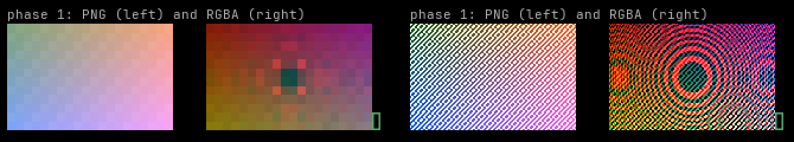

# herdr-patch

`herdr-patch` makes [Herdr](https://github.com/herdrdev/herdr) work over mosh: it removes the opaque background fill, and it shows the images in the panes. It is one Python 3 script that uses only the standard library (Python 3.9 or later). You install the same file on the server and on your computer.

## The problems

Herdr 0.9.3 keeps a "host background" color in the server. After a client attaches again, Herdr can paint this color over older panes as an opaque fill ([herdr#3773](https://github.com/herdrdev/herdr/issues/3773)). A terminal tells Herdr its colors when it answers the OSC 10 and OSC 11 color queries. mosh never answers these queries. Thus, over mosh, the fill shows as a solid block and not as the transparent background of your terminal.

Herdr sends each image in a pane as kitty graphics. mosh carries only text, so it drops the images.

`herdr --remote` and plain SSH do not have these problems, because their terminals answer the color queries and receive the graphics.

## Where it runs

The first argument tells where `herdr-patch` runs:

| Command | Where | What it does |
| --- | --- | --- |
| `herdr-patch <host> [herdr arguments...]` | Your computer | Starts mosh to `<host>` with `herdr-patch` on the server, and writes the real images into your terminal. |
| `herdr-patch [herdr arguments...]` | The server | Runs Herdr for a mosh client: removes the fill and paints the images as half-block characters. |
| `herdr-patch --help` | Either | Shows the usage. It does not need a terminal. |

If the first argument does not start with `-`, it is the host. If there is no argument, or the first argument starts with `-`, `herdr-patch` runs on the server. Herdr arguments replace the default `--session default`, so on the server they must start with an option, for example `--session lab`.

## Install

### On the server

1. Copy the script to your `~/.local/bin` directory:

   ```bash
   install -m 755 herdr-patch ~/.local/bin/
   ```

2. Make a link to the script in `/usr/local/bin`:

   ```bash
   sudo ln -s ~/.local/bin/herdr-patch /usr/local/bin/herdr-patch
   ```

You must make the link because `mosh-server` and non-interactive SSH commands start with a `PATH` that does not include `~/.local/bin`. Without the link, mosh and SSH cannot find `herdr-patch`. The same link is necessary for `herdr` (`/usr/local/bin/herdr`).

On a Crewship host, `./factory apply` does these steps from the checkout, and links `herdr` too. Its verification makes sure that `herdr` and `herdr-patch` resolve with the `PATH` of `mosh-server`.

Each mosh login starts a new `herdr-patch` process. Thus, after you install a new version, you do not have to restart Herdr.

### On your computer

Copy the same script to a directory on your `PATH`:

```bash
install -m 755 herdr-patch ~/.local/bin/
```

Your computer also needs `mosh` and `ssh`. macOS has Python 3.9 in `/usr/bin/python3`. `ssh <host>` must log in without a password prompt, for example with a key in your SSH agent. Your terminal must show kitty graphics: WezTerm (the `enable_kitty_graphics` setting is on by default) or kitty.

## Use

On your computer:

```bash
herdr-patch <user>@<host>
```

Arguments after the host go to Herdr on the server. For example, `herdr-patch <user>@<host> --session lab` attaches to the `lab` session.

If you do not give a user, mosh and SSH log in with the name of your local user. To set the user in one location, write it in an SSH config `Host` alias:

```
Host <alias>
    HostName <host>
    User <user>
```

Then `herdr-patch <alias>` logs in as `<user>`.

In a mobile mosh app, or with plain mosh, set the host command to `herdr-patch`:

```bash
mosh <user>@<host> -- herdr-patch
```

This removes the fill and shows each image as half-block characters, but not as a real image.

## Images




On the server, `herdr-patch` takes the kitty graphics out of the output of Herdr. In their place, it paints half-block characters (2 pixels in each cell) into the cells of each image, and blanks these cells when Herdr deletes the image. Every mosh client can show these characters.

On your computer, each `herdr-patch <host>` makes a random token and starts `mosh <host> -- herdr-patch --channel <token>`. That server process serves its images on the Unix socket `/tmp/herdr-patch-<uid>/<token>`. The directory has mode 700 and the socket has mode 600, so only your user can open it. Your computer reads the socket of its own server process through `ssh <host> herdr-patch --read <token>`, and writes the images over the half-block characters.

The images go into your terminal only between escape sequences. After mosh erases or scrolls cells, and after a resize, `herdr-patch` writes the image placements again. If the SSH connection stops, mosh continues without images, and `herdr-patch` connects again.

### Set the apps to kitty graphics

An app shows real images only when it sends kitty graphics. Set this line in the configuration file of the app:

- Concord: `image_protocol = "kitty"`
- slk: `image_protocol = "kitty"`

Keep the Herdr setting `terminal.kitty_graphics` on. It is on by default.

## The fill list

On the server, the `HERDR_PATCH_FILL` environment variable sets the fill list: the truecolor backgrounds that become the default background (SGR 49). Write it as hex colors, with commas between them. A `#` before a color is optional. The default value is `1e1e1e,232136`: the fallback color of Herdr, and a rose-pine-moon background that Herdr keeps after a `herdr --remote` client. An empty value changes nothing.

To add a color, set the variable in the mosh command:

```bash
mosh <user>@<host> -- env HERDR_PATCH_FILL=1e1e1e,232136,2a273f herdr-patch
```

A pane program that uses a color from the fill list as its own background also loses that background.

`HERDR_BIN_PATH` sets the Herdr program to run. The default is `herdr`.

## What it changes

In the output of Herdr, `herdr-patch` changes only these things:

- A truecolor background that is on the fill list becomes the default background (SGR 49).
- The kitty graphics commands (`ESC _ G ... ESC \`) are taken out, and half-block characters are painted in their place.

Every other output byte goes through without change. Keys and the window size go to Herdr without change. When Herdr stops, `herdr-patch` stops with the exit status of Herdr.

## Limits

- WezTerm and kitty show the images. Other terminals show only the half-block characters. We tested WezTerm 20240203-110809-5046fc22.
- The images and the text come on two different connections. After a scroll, an image can show at its old position for a short time.
- The images go through SSH as zlib-compressed RGBA (fast compression level). An 800x600 photo is approximately 1 to 2 MB. On a slow connection, the images come after the text.
- The half-block characters do not show transparency.
- The server keeps each image in memory until Herdr deletes it.
- The server drops an image that inflates to more than 64 MiB. It also drops an image reader that is more than 64 MiB behind. After the next connection, the reader gets all current images again.
- The server paints a PNG image (kitty `f=100`) as half-block characters only when it is an 8-bit RGB or RGBA PNG without interlacing, and has at most 32768 pixels (for example 256x128). Larger PNG images and other PNG forms go to the reader but show no half-block characters. Herdr 0.9.3 re-encodes the images of apps to raw RGBA, so this case is rare.

## Removal

When Herdr fixes [#3773](https://github.com/herdrdev/herdr/issues/3773) and you do not use the images, remove `herdr-patch` from the server:

```bash
sudo rm /usr/local/bin/herdr-patch
rm ~/.local/bin/herdr-patch
```

Then attach with `mosh <user>@<host> -- herdr` again. On a Crewship host, also remove the install and link tasks in `ansible/tasks/herdr.yml` and the check in `ansible/tasks/verify.yml`.

## Tests

[`tests/test_herdr_patch.py`](../tests/test_herdr_patch.py) runs with the rest of the suite (`uv run pytest`). CI also runs it with Python 3.9, the version that macOS ships:

```bash
uvx --python 3.9 pytest tests/test_herdr_patch.py
```
